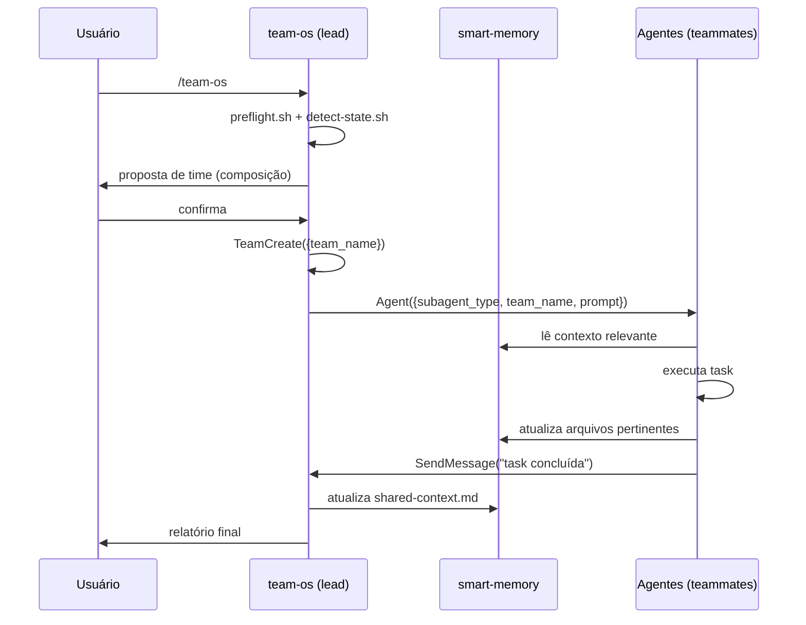
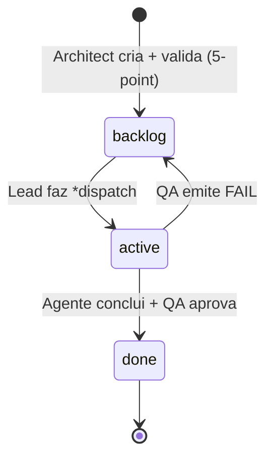

# Arquitetura

## Padrão

**Centro de Treinamento de Agentes (CT) — infraestrutura de Agent Teams.**

Não é um projeto de software tradicional. É um sistema de orquestração de agentes Claude Code nativos, estruturado como uma coleção de squads especializadas que operam sobre uma memória compartilhada (smart-memory) coordenadas por um team lead (skill `/team-os`).

Padrão arquitetural: **Hub-and-Spoke com memória compartilhada centralizada.**
- Hub: skill `/team-os` rodando na main session
- Spokes: até 37 agentes especializados (teammates)
- Memória: `docs/smart-memory/` no padrão Obsidian

---

## Camadas

| Camada | Path | Responsabilidade |
|---|---|---|
| **Orquestração** | `.claude/skills/team-os/` | Detecta estado, forma teams, despacha tasks, monitora progresso, audita smart-memory |
| **Factory** | `.claude/skills/team-os-creator/` | Gera agentes, valida compliance, propaga squads para projetos do CT |
| **Agentes** | `.claude/agents/*.md` | 37 especialistas distribuídos em 4 squads (dev, sites, social, traffic) |
| **Skills** | `.claude/skills/*/SKILL.md` | 42 skills especializadas por domínio, invocadas via `/nome-da-skill` |
| **Memória** | `docs/smart-memory/` | Fonte de verdade compartilhada — stories, ADRs, contexto de projeto, ops log |
| **Enforcement** | `.claude/hooks/*.sh` | Guardrails automáticos: bloqueia git push em agentes não-autorizados, monitora progresso de stories |

---

## Fluxo Principal



---

## Protocolo de Comunicação

Todo agente segue o **Contrato com team-os** (injetado em `.claude/agents/*.md`):

```
Agente → Lead:  SendMessage(to: "team-os", message: "...")
Lead → Agente:  SendMessage(to: "{nome-agente}", message: "...")
Agente ↛ Agente: PROIBIDO sem autorização explícita do lead
```

Coordenação é estritamente unidirecional (agente → lead). Comunicação lateral entre agentes requer intermediação do lead.

---

## Estados do Projeto (detect-state.sh)

```
NEW            → smart-memory não existe → bootstrap automático
NO_DISCOVERY   → estrutura existe mas < 2 de (modules, tech-stack, architecture) → oferecer *discover
IN_PROGRESS    → há stories em stories/active/ → *resume automático
READY          → smart-memory OK, sem stories ativas → intake de novo objetivo
```

---

## Autoridades Exclusivas por Squad

Cada squad possui papéis com autoridade exclusiva — nenhum outro agente pode invadir:

| Squad | Autoridade | Agente |
|---|---|---|
| dev | git push / PRs | `dev-devops` (Grav) |
| dev | veredictos formais | `dev-qa` (Axis) |
| dev | criar/validar stories | `dev-architect` (Zaelor) |
| sites | git push / deploy | `sites-devops` |
| sites | veredictos | `sites-qa` |
| sites | stories | `sites-architect` |
| social | publicação | `social-publisher` |
| social | validação editorial | `social-strategist` (VERA) |
| traffic | métricas oficiais | `traffic-bi` |
| traffic | veredictos de campanha | `traffic-qa` |
| traffic | integrações API | `traffic-automation` |
| traffic | stories de campanha | `traffic-strategist` |

---

## Mapa de Dependências Principais

```
/team-os (SKILL.md)
  ← detect-state.sh          (roteamento de estado)
  ← list-teammates.sh        (catálogo de agentes disponíveis)
  ← audit-smart-memory.sh    (integridade da memória)
  ← audit-teammate-compliance.sh (conformidade dos agentes)
  ← teammate-contract.md     (contrato canônico)
  ← templates/               (scaffolding de smart-memory)

/team-os-creator (SKILL.md)
  ← detect-project-signals.sh  (detecta stack do projeto destino)
  ← generate-agent.sh           (gera .md do agente)
  ← validate-agent.sh           (compliance check)
  ← scan-ct-projects.sh         (mapeia projetos do CT)
  ← diff-agents.sh              (detecta desatualizações)
  ← install-to-project.sh       (propaga agentes + skills)
  ← presets/*.yaml              (composições pré-definidas de squad)
  ← archetypes.md               (defaults de frontmatter por archetype)
  ← team-os/reference/teammate-contract.md  (injetado em cada agente)

Agentes (.claude/agents/*.md)
  ← team-os/reference/teammate-contract.md  (via *enroll)
  ← docs/smart-memory/                       (fonte de verdade)
  → docs/smart-memory/                       (produzem output aqui)

Hooks
  ← block-git-push.sh         (referenciado no frontmatter de dev-dev-*)
  ← check-story-progress.sh   (SubagentStop — monitora todas as stories ativas)
```

---

## Ciclo de Vida de uma Story



1. **Architect** cria story em `stories/backlog/` + valida com 5-point checklist
2. **Lead** verifica god nodes — se story toca god node, QA é obrigatório
3. **Lead** cria TaskCreate + despacha via `*dispatch`
4. **Implementer** faz self-claim da task via TaskList
5. **QA** emite veredicto formal (PASS/CONCERNS/FAIL/WAIVED)
6. **DevOps** faz push apenas após QA PASS

---

## Propagação para Projetos do CT

O CT Agentes atua como **fonte** para outros projetos do Centro de Treinamento:

```
CT Agentes (fonte)
  → /team-os-creator *propagate
    → scan-ct-projects.sh   (descobre projetos irmãos)
    → diff-agents.sh        (detecta diff)
    → install-to-project.sh (copia agentes + skills + team-os)
      → Projeto destino (ex: aiox, outro-projeto)
```

Smart-memory **não** é propagada — cada projeto destino roda `/team-os` para gerar sua própria smart-memory com dados reais do seu codebase.

---

## Decisões Arquiteturais Identificadas

1. **team-os-creator nunca vai para projetos destino** — a factory fica apenas no CT Agentes para evitar recursão e manter controle centralizado de versão dos agentes.

2. **Smart-memory é responsabilidade exclusiva do team-os** — o creator deliberadamente não scaffolda smart-memory para que o `detect-state.sh` detecte `NEW` e rode bootstrap real com discovery completo.

3. **Worktree apenas para implementer/hardening** — agentes que escrevem código ficam isolados para permitir paralelismo sem conflito no branch principal.

4. **Hook git push como guardrail de processo** — a autoridade de push é arquitetural, não apenas convencional. O hook torna a regra inviolável em runtime.

5. **Modelo opus para reviewer/architect/orchestrator** — papéis de decisão usam o modelo mais capaz; execução usa sonnet para custo/velocidade.
